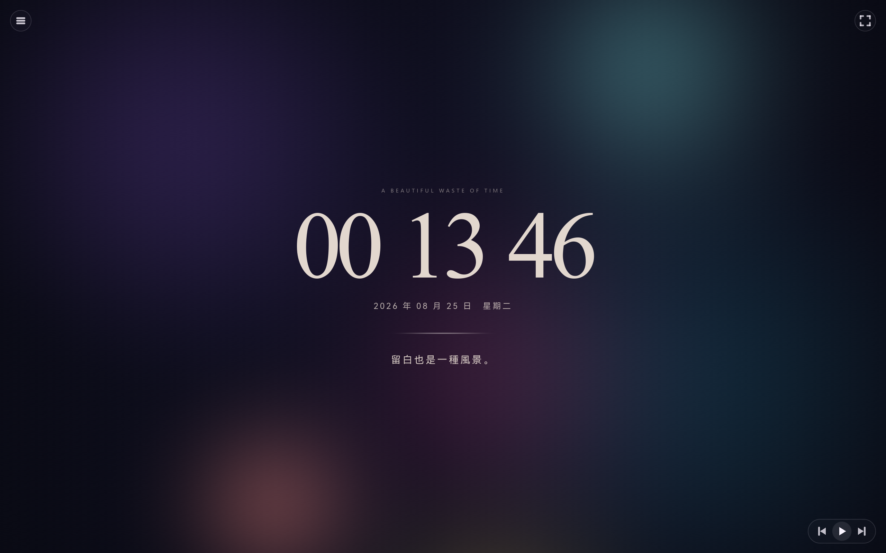

# 美丽的废物 · Beautiful Waste

> 一个只负责好看的 Windows 氛围时钟。没有生产力，只有时间、光和留白。



Beautiful Waste 是用 Rust 原生构建的桌面待机应用。WGPU 着色器绘制持续流动的模糊光雾，Glyphon 负责文字排版；不依赖 Electron、WebView 或额外运行时。

## 功能

- 动态、柔和且无明显边缘的迷幻光雾
- 中央时钟、日期、星期与轮换短句
- 五种可切换的时钟字体、12／24 小时制和多种日期格式
- 动画速度与中央时钟大小调节
- 秒数与短句显示开关
- 自定义语句库：添加、删除和从 TXT 文件批量导入
- 可调整语句切换间隔，并选择顺序或随机播放
- 从左侧滑出的可滚动设置菜单
- Windows 系统媒体控制：上一首、播放／暂停、下一首
- 右上角独占全屏；按 `Esc` 退出
- 自动保存偏好设置，启动后恢复
- 可在设置底部删除全部用户文件并恢复默认状态

## 下载与运行

从 [Releases](../../releases) 下载 `Beautiful-Waste-v1.1.2-windows-x64.zip`，解压后直接运行 `beautiful-waste.exe`。

支持 Windows 10/11，并需要可用的 DirectX 12 或 Vulkan 图形驱动。

## 自定义语句

- 在 `CUSTOM TEXT` 中输入一句话，然后选择 `ADD PHRASE`
- 使用 `PREV`／`NEXT` 浏览语句，选择 `DELETE` 移除当前语句
- `IMPORT TXT` 会把 TXT 文件中的每个非空行导入为一句话
- `CHANGE EVERY` 调整切换间隔，`PLAYBACK ORDER` 切换顺序或随机播放

## 本地数据

程序只在本地保存数据，不需要账号或网络连接：

```text
%APPDATA%\Beautiful Waste\settings.ini
%APPDATA%\Beautiful Waste\thoughts.txt
```

设置菜单底部的 `DELETE USER FILES` 需要连续确认两次；执行后会删除以上文件，并立即恢复默认设置和内置语句。

## 开发

需要 Rust stable：

```powershell
cargo run
```

构建优化后的单文件 Windows 程序：

```powershell
cargo build --release
```

输出位于 `target/release/beautiful-waste.exe`。应用图标会嵌入 EXE，无需附带其他运行文件。

## 项目结构

```text
src/main.rs       # 窗口、排版、交互、设置与系统媒体控制
src/visual.wgsl   # 光雾、噪点、控件和自绘图标着色器
assets/           # README 展示图片
build.rs          # Windows 图标与版本资源
icon.ico          # 应用图标
```

## 许可证

[MIT](LICENSE) © 2026 沈承睿
